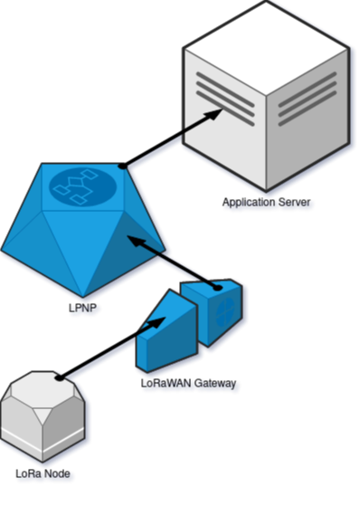

# LoRaWAN

## LoRaWAN Node setup procedure



### Terms

- **Node**: the sensor node.
- **LPNP**: Low Power Network Provider, usually The Things Network or Swisscom. The LPNP is responsible for forwarding data received on its gateways to the application server.
- **Gateway**: the receiver through which data between the *Node* and the *LPNP* flows.
- **Application Server**: the server where the *LPNP* forwards data coming from the *Node*, running the *Application*. Contains the business logic.
- **DevEUI**: globally unique ID of the *Node*.
- **AppEUI/JoinEUI**: globally unique ID of the *Join Server*(???). Mostly provided by the *LPNP*, but can be obtained by the application owner.
- **AppKey**: AES key for securing the communication between a *Node* and a *Gateway*. May be either distinct or shared between *Nodes* of an application depending on the use case.
- **AT**: Command set for configuring and using modems. Sent over a serial connection as strings.

### Node registration

In order for the *LPNP* to know where to forward received payloads, all *Nodes* and *Applications* must be registered at the *LPNP*.
- Log in to the *LPNP* console
- Add another application. The “Application ID” can be any unique string you want. The *AppEUI* will probably be provided by the *LPNP*.
- Add a new *Node* to the *Application*. You can either use the *DevEUI* already stored on the board or you can use one provided by the *LPNP*. To receive the one on the board, run the following AT command:

```at
at+get_config=lora:status
```

- If you want to use the *DevEUI* from the *LPNP*, run the following command to store it on the device:

```at
at+set_config=lora:dev eui:XXXX
```

### Activation

The connection between a *Node* and a *Gateway* must be secured. There are two options, the Over-The-Air-Activation (OTAA) and the Activation By Personalization (ABP). ABP mode is easier to setup and less secure, and should only be used in test environments. The following steps therefore describe OTAA.

Before starting, note the *Nodes* *DevEUI*, *AppEUI* and the *AppKey* which was generated when registering the *Node*.
- Connect the *Node* to a serial port and send the following AT commands to set the mode to OTAA, the class to A and the region to EU (you are allowed to send either on the 433MHz or the 863-870MHz band, but 868MHz is preferred because of the lower congestion).

```at
at+set_config=lora:join_mode:0
at+set_config=lora:class:0
at+set_config=lora:region:EU868
```

- Enter the following AT commands to set the *DevEUI*, *AppEUI* and *AppKey*:

```at
at+set_config=lora:dev_eui:XXXX
at+set_config=lora:app_eui:XXXX
at+set_config=lora:app_key:XXXX
```

###​ Join and test

To connect the *Node* to the network, run the following AT command:

```at
at+join
```

To send an uplink message, run the following command, replacing 12345678 with any data you want:

```at
at+send=lora:1:12345678
```

The message should show up in the dashboard of your *LPNP*.

## LPNP to Application Server Payloads

###​ Swisscom

```json
{
   "DevEUI_uplink":{
      "Time":"2016-09-27T12:26:59.886+02:00",
      "DevEUI":"FF000012FF000012",
      "FCntUp":"39",
      "ACKbit":"1",
      "ADRbit":"1",
      "MType":"2",
      "FCntDn":"13",
      "payload_hex":"000009f4",
      "mic_hex":"c9cea2c2",
      "Lrcid":"00000401",
      "LrrRSSI":"-105.000000",
      "LrrSNR":"-12.750000",
      "SpFact":"10",
      "SubBand":"G3",
      "Channel":"LC6",
      "DevLrrCnt":"1",
      "Lrrid":"29000128",
      "LrrLAT":"47.379795",
      "LrrLON":"8.527121",
      "Lrrs":{
         "Lrr":{
            "Lrrid":"29000128",
            "Chain":"0",
            "LrrRSSI":"-105.000000",
            "LrrSNR":"-12.750000",
            "LrrESP":"-117.974648"
         }
      },
      "CustomerID":"100000304",
      "CustomerData":{
         "alr":{
            "pro":"LORA/Generic",
            "ver":"1"
         }
      },
      "ModelCfg":"0",
      "AppSKey":"76bc91003738157fbe9f37b3ba9d677a",
      "InstantPER":"0.000000",
      "MeanPER":"0.015571"
   }
}
```

### The Things Network

```json
{
  "app_id": "my-app-id",
  "dev_id": "my-dev-id",
  "hardware_serial": "0102030405060708", // the DevEUI
  "port": 1,
  "counter": 2,
  "is_retry": false,
  "confirmed": false,
  "payload_raw": "AQIDBA==", // Base64 payload 0x01020304
  "payload_fields": {},
  "metadata": {
    "time": "1970-01-01T00:00:00Z",
    "frequency": 868.1,
    "modulation": "LORA",
    "data_rate": "SF7BW125",
    "bit_rate": 50000,
    "coding_rate": "4/5",
    "gateways": [
      {
        "gtw_id": "ttn-herengracht-ams",
        "timestamp": 12345,
        "time": "1970-01-01T00:00:00Z",
        "channel": 0,
        "rssi": -25,
        "snr": 5,
        "rf_chain": 0,
        "latitude": 52.1234,
        "longitude": 6.1234,
        "altitude": 6
      },
      //...more if received by more gateways...
    ],
    "latitude": 52.2345,
    "longitude": 6.2345,
    "altitude": 2
  },
  "downlink_url": "https://integrations.thethingsnetwork.org/ttn-eu/api/v2/down/my-app-id/my-process-id?key=ttn-account-v2.secret"
}
```

